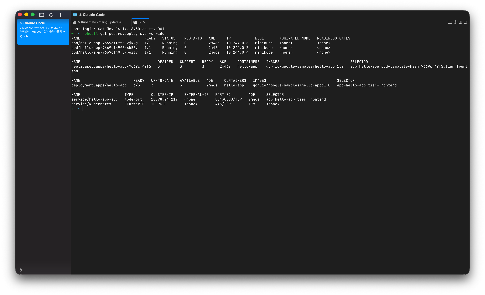
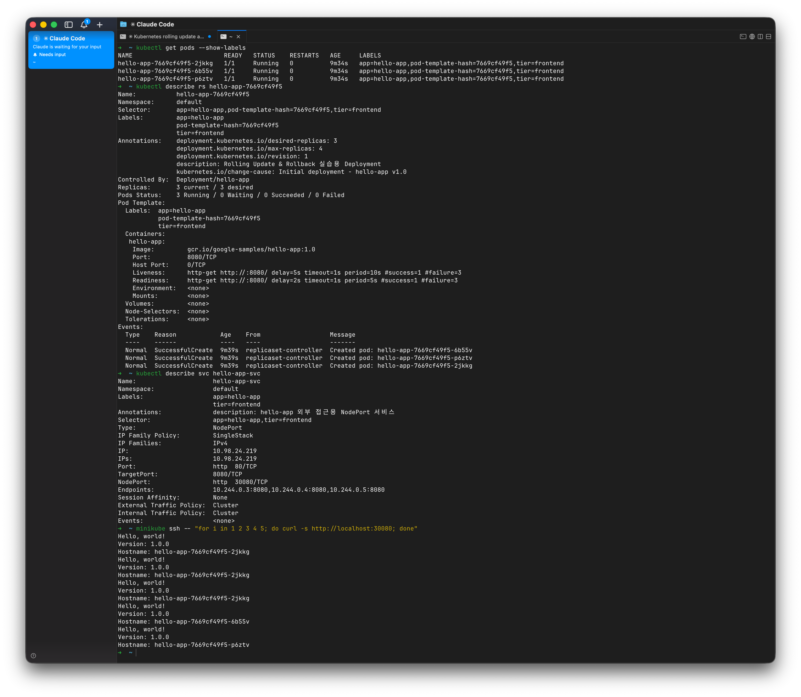
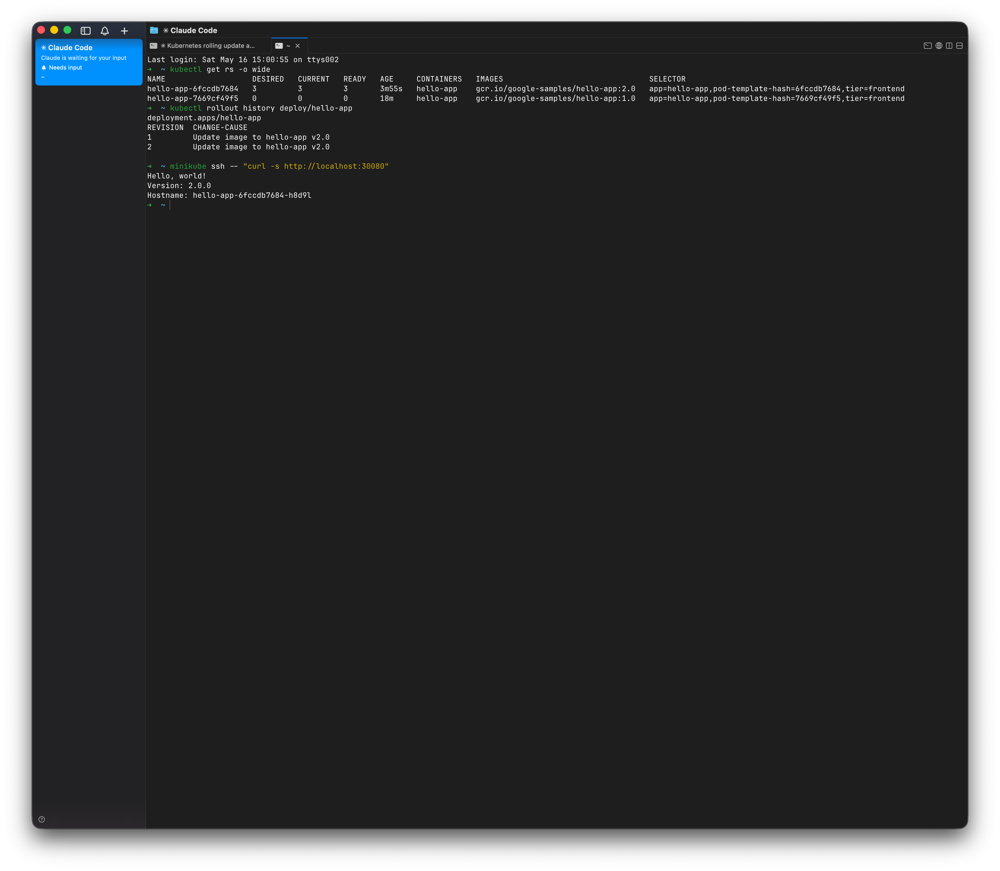
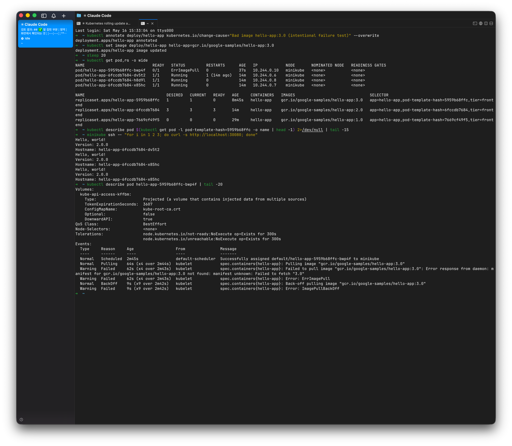
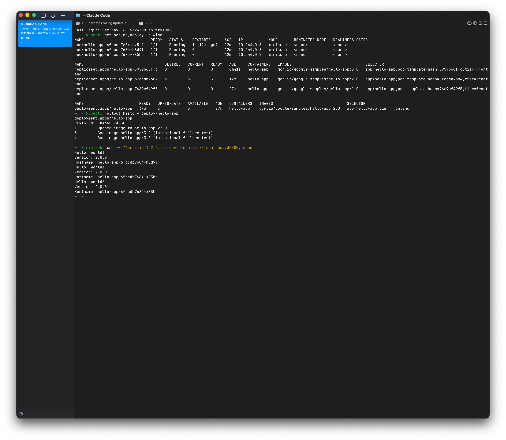

# Kubernetes Rolling Update 및 장애 복구 실습

> 분산 시스템을 위한 컨테이너 아키텍처 과목 / Rollout & Rollback

`Deployment`, `ReplicaSet`, `Service`의 상호작용을 직접 관찰하고, 의도적인 장애를 발생시킨 후 `kubectl rollout undo`로 복구하는 실습.

**Repository**: https://github.com/KasRoid/k8s-rollout-and-rollback

---

## 📋 제출 항목 체크리스트

| # | 제출 항목 | 증거 위치 |
|---|---|---|
| ① | 실습에 사용한 YAML 파일 | [`deployment.yaml`](deployment.yaml) · [`service.yaml`](service.yaml) |
| ② | 최초 배포 후 Pod/RS/Deploy/Svc 상태 | [`results/01-initial-deployment.txt`](results/01-initial-deployment.txt) · [§4](#4-최초-배포-상태) |
| ③ | 사용자 서비스 접근 결과 | [`results/02c-curl-access.txt`](results/02c-curl-access.txt) · [§5](#5-라벨--셀렉터--어노테이션-증명) |
| ④ | Pod/RS/Deploy/Svc 관계 확인 | [`results/02a-labels-and-rs.txt`](results/02a-labels-and-rs.txt) · [`02b`](results/02b-service-and-deployment.txt) · [§5](#5-라벨--셀렉터--어노테이션-증명) |
| ⑤ | Label/Selector/Annotation 사용 확인 | [§5](#5-라벨--셀렉터--어노테이션-증명) (표 + 스크린샷) |
| ⑥ | 새 버전 배포 전후 상태 변화 | [`results/03b-update-progress.txt`](results/03b-update-progress.txt) · [§6](#6-rolling-update-v10--v20) |
| ⑦ | 배포 이력 확인 | [`results/03c-update-complete.txt`](results/03c-update-complete.txt) (rollout history) · [§6](#6-rolling-update-v10--v20) |
| ⑧ | 장애 오류 메시지 + 상태 변화 | [`results/04c-failure-events-and-survival.txt`](results/04c-failure-events-and-survival.txt) · [§7](#7-의도적-장애-유발과-서비스-유지) |
| ⑨ | rollback 후 정상 복구 | [`results/05b-recovered.txt`](results/05b-recovered.txt) · [§8](#8-rollback-및-복구) |
| ⑩ | 장애 원인/복구 설명 | [§7](#7-의도적-장애-유발과-서비스-유지), [§8](#8-rollback-및-복구) |
| ⑪ | 주요 명령어 스크린샷 | [`screenshots/`](screenshots/) (본 README에 인라인 임베드) |

---

## 1. 실습 환경

| 항목 | 값 |
|---|---|
| OS | macOS 26.4 (arm64) |
| 컨테이너 런타임 | colima (Docker Desktop 대안, CLI 전용) |
| Kubernetes | minikube v1.38.1 (driver: docker) |
| Cluster version | v1.35.1 |
| kubectl | v1.36.1 |
| 사용 이미지 | `gcr.io/google-samples/hello-app:1.0` / `:2.0` (장애용 `:3.0` — 존재하지 않음) |

상세: [`results/00-environment.txt`](results/00-environment.txt)

## 2. 리소스 구성

### [`deployment.yaml`](deployment.yaml)
- `replicas: 3` — **항상 3개 서버 유지**
- `strategy.type: RollingUpdate` (`maxSurge: 1`, `maxUnavailable: 0`)
  - 새 Pod이 ready된 뒤에야 기존 Pod 제거 → **다운타임 0**
- `revisionHistoryLimit: 10` — 배포 이력 보관
- `readinessProbe` — 컨테이너가 8080에 응답해야 Service Endpoints에 등록
- `livenessProbe` — 죽은 컨테이너 자동 재시작

### [`service.yaml`](service.yaml)
- `type: NodePort`, `nodePort: 30080`
- `selector: {app: hello-app, tier: frontend}` — Deployment의 Pod 라벨과 매칭

## 3. Phase별 진행 결과 요약

| Phase | 내용 | 결과 파일 | 스크린샷 |
|---|---|---|---|
| 0 | 환경 준비 | `00-environment.txt` | — |
| 1 | 최초 배포 (v1.0) | `01-initial-deployment.txt` | `01-initial-state.png` |
| 2 | 관계/라벨/셀렉터/어노테이션 증명 | `02a..02c-*.txt` | `02-relationships-and-access.png` |
| 3 | 정상 업데이트 (v1.0→v2.0) | `03a..03d-*.txt` | `03-rolling-update.png` |
| 4 | 의도적 장애 (v3.0, 존재하지 않는 태그) | `04a..04c-*.txt` | `04-failure.png` |
| 5 | 롤백 (→ v2.0) | `05a..05b-*.txt` | `05-rollback.png` |

---

## 4. 최초 배포 상태

배포 후 `kubectl get pod,rs,deploy,svc -o wide` 결과:



이 한 화면에 담긴 핵심:
- **Pod ×3** 모두 `Running 1/1`, IP `10.244.0.3/4/5`
- **ReplicaSet** `hello-app-7669cf49f5` (DESIRED=3, CURRENT=3, READY=3)
- **Deployment** `hello-app` (3/3 ready, image `hello-app:1.0`)
- **Service** `hello-app-svc` (NodePort `80:30080/TCP`)
- Pod 이름 규칙: `{Deployment 이름}-{ReplicaSet 해시}-{랜덤}` → 자동으로 계보 부여
- RS/Deploy/Svc 모두 `SELECTOR` 컬럼에 라벨 노출

## 5. 라벨 / 셀렉터 / 어노테이션 증명



### 동작 관계도

```
[Deployment hello-app]
       │  생성/소유
       ▼
[ReplicaSet hello-app-<pod-template-hash>]
       │  생성/소유
       ▼
[Pod ×3]   labels: app=hello-app, tier=frontend, pod-template-hash=...
       ▲  selector로 발견
       │
[Service hello-app-svc]   selector: app=hello-app, tier=frontend
       │  → resolves to
       ▼
[Endpoints  <Pod IP>:8080 × N]
```

### 증명한 방법

- `kubectl get pods --show-labels` → Pod에 `app/tier/pod-template-hash` 라벨 존재
- `kubectl describe rs ...` → `Selector`가 Pod 라벨과 일치, `Controlled By: Deployment/hello-app`
- `kubectl describe svc ...` → `Endpoints`에 정확히 3개 Pod IP가 자동 등록 (`10.244.0.3:8080, 10.244.0.4:8080, 10.244.0.5:8080`)
- `Events`에 `replicaset-controller Created pod: ...` ×3 → RS가 Pod를 만든다는 것이 컨트롤러 로그로 확인
- 화면 하단 5회 curl: `Version: 1.0.0` 응답, **3개 Pod 호스트네임이 모두 등장** → Service가 트래픽을 Pod들에 분산

### Label / Selector / Annotation 비교

| 메커니즘 | 위치 | 목적 | 본 실습에서의 역할 |
|---|---|---|---|
| **Label** | `metadata.labels`, `spec.template.metadata.labels` | 리소스에 식별/분류 정보를 붙임 | `app=hello-app`, `tier=frontend`으로 Pod들을 묶음 |
| **Selector** | `spec.selector` | Label을 기준으로 다른 리소스를 동적으로 발견 | Service가 selector로 Pod를 찾아 Endpoints 자동 구성. RS는 selector로 자기 Pod만 관리 (`pod-template-hash` 포함) |
| **Annotation** | `metadata.annotations` | 식별이 아닌 부가 메타데이터 | `kubernetes.io/change-cause`로 배포 사유 기록 → `kubectl rollout history`에 표시. 한글 description으로 운영자 메모 |

**중요한 차이**:
- Service의 selector는 `pod-template-hash` 없이 `app`, `tier`만 사용
  → **새 버전 RS의 Pod도 자동으로 같은 Service에 잡힘** → Rolling update 중 다운타임 없이 트래픽이 자연 이동
- RS의 selector는 `pod-template-hash`를 포함
  → 자기 RS가 만든 Pod만 관리, 다른 버전 Pod은 건드리지 않음

## 6. Rolling Update v1.0 → v2.0

### 실행한 명령
```bash
kubectl annotate deploy/hello-app kubernetes.io/change-cause="Update image to hello-app v2.0" --overwrite
kubectl set image deploy/hello-app hello-app=gcr.io/google-samples/hello-app:2.0
```

### 업데이트 진행 과정 (`results/03b-update-progress.txt`에서 발췌)

```
--- t=0s ---
RS  hello-app-6fccdb7684  desired=2 current=2 ready=1  image=...:2.0   ← 신규 RS
RS  hello-app-7669cf49f5  desired=2 current=2 ready=2  image=...:1.0   ← 기존 RS

--- t=4s ---
RS  hello-app-6fccdb7684  desired=3 current=3 ready=2  image=...:2.0   ← 새 Pod 추가됨
RS  hello-app-7669cf49f5  desired=1 current=1 ready=1  image=...:1.0   ← 기존 1개로 줄음
```

`maxSurge:1, maxUnavailable:0` 효과로 항상 3개 이상 Pod이 ready 상태를 유지하며 점진적 교체.

### 업데이트 완료 후 상태 + 배포 이력



- 신RS `6fccdb7684` (3/3/3, v2.0) — 활성
- 구RS `7669cf49f5` (0/0/0, v1.0) — **삭제되지 않고 보관** (롤백을 위한 안전장치)
- `kubectl rollout history` → revision 1, 2 표시
- curl 응답: `Version: 2.0.0` (신RS Pod에서 응답)

## 7. 의도적 장애 유발과 서비스 유지

### 시나리오
존재하지 않는 이미지 태그 `hello-app:3.0`으로 업데이트 시도.

```bash
kubectl annotate deploy/hello-app kubernetes.io/change-cause="Bad image hello-app:3.0 (intentional failure test)" --overwrite
kubectl set image deploy/hello-app hello-app=gcr.io/google-samples/hello-app:3.0
```

### 발생한 오류와 상태 변화



이 한 화면에서 확인 가능한 것:

1. **새 Pod의 STATUS**: `ErrImagePull` → 이후 `ImagePullBackOff`로 전환
2. **새 RS** `5959b68ffc`: DESIRED=1, CURRENT=1, **READY=0**
3. **기존 v2.0 RS** `6fccdb7684`: 3/3/3 **그대로 유지** ← `maxUnavailable: 0`의 효과
4. **`describe pod`의 Events** (화면 하단):
   ```
   Normal  Pulling   spec.containers{hello-app}: Pulling image "gcr.io/google-samples/hello-app:3.0"
   Warning Failed    Failed to pull image: Error response from daemon:
                     manifest for gcr.io/google-samples/hello-app:3.0 not found:
                     manifest unknown: Failed to fetch "3.0"
   Warning Failed    Error: ErrImagePull
   Normal  BackOff   Back-off pulling image
   Warning Failed    Error: ImagePullBackOff
   ```
5. **사용자 응답 (curl 3회)**: 모두 `Version: 2.0.0`, 3개 v2.0 Pod에서 응답 → **장애 중에도 서비스 100% 유지**

### 장애 원인 분석

- 직접 원인: 레지스트리에 `gcr.io/google-samples/hello-app:3.0` 태그가 존재하지 않음
- 직접 영향: 새 Pod 1개가 이미지를 못 받아 영원히 `ImagePullBackOff` 상태로 멈춤
- 서비스가 살아남은 이유: 
  - `maxUnavailable: 0` 설정 → 새 Pod이 ready되기 전까지는 기존 Pod을 죽이지 않음
  - `readinessProbe` 미통과 → 장애 Pod IP가 Service Endpoints에서 자동 제외
  - 결과적으로 트래픽은 살아있는 v2.0 Pod 3개로만 라우팅됨

## 8. Rollback 및 복구

### 실행한 명령
```bash
kubectl rollout undo deploy/hello-app
kubectl rollout status deploy/hello-app
```

### 복구 후 상태



- 장애 RS `5959b68ffc` → 0/0/0으로 scale down되며 **삭제 없이 보관** (다시 시도 가능)
- v2.0 RS `6fccdb7684` → 그대로 3/3/3 유지 (장애 내내 살아있던 그 Pod 3개)
- `rollout history` → 새 revision 추가 (v2.0 템플릿이 재사용됨)
- curl 응답 → `Version: 2.0.0` 즉시 복귀 확인

### 복구 과정 요약

1. **`kubectl rollout undo`**: 직전 revision의 Pod 템플릿(v2.0)으로 Deployment의 `spec.template`를 되돌림
2. Deployment 컨트롤러가 변경을 감지하고 동작:
   - 장애 RS(`5959b68ffc`)를 0으로 scale down
   - v2.0 RS(`6fccdb7684`)는 이미 3개로 유지 중이라 추가 작업 없음
3. 새 revision이 history에 추가됨 (재사용된 템플릿이지만 새 번호 부여)

### 특히 흥미로운 관찰

복구 후 Pod 3개의 이름이 장애 전과 **완전히 동일** (`dv5t2`, `h8d9l`, `x85hc`).
→ `maxUnavailable: 0` 덕분에 **장애 동안 한 번도 죽지 않았음**.
→ 실제로 "복구"라기보다 "변경되지 않았음을 확정짓기"가 더 정확한 표현.

## 9. 발견한 K8s 동작 메커니즘

이번 실습에서 직접 관찰한 비교적 미세한 K8s 동작들.

### 9-1. `change-cause` 어노테이션의 전파
`kubectl annotate deploy/... kubernetes.io/change-cause=...`로 어노테이션을 갱신하면, Deployment 컨트롤러가 **현재 보관 중인 모든 RS에 이 값을 동기화**한다. 따라서 `kubectl rollout history`의 `CHANGE-CAUSE` 열은 **revision별로 보존되는 게 아니라 현재의 Deployment annotation 값으로 일괄 표시**된다.

→ revision별로 다른 change-cause를 남기고 싶다면, 각 rollout 시점에 적절한 annotation을 설정하고 그 뒤로는 수정하지 않아야 한다. 또는 `kubectl set image --record`(이전 버전에서는 가능, 최신은 deprecated)를 쓰는 방법도 있었다.

### 9-2. Rolling Update의 무중단성
`maxSurge: 1, maxUnavailable: 0` 설정에서:
- 새 Pod이 ready된 뒤에야 기존 Pod 1개를 종료
- 따라서 항상 **최소 3개 Pod이 ready** 상태로 유지됨
- 장애 상황에서도 새 Pod이 ready 못 되므로 기존 Pod이 그대로 살아있음 → 무중단

### 9-3. ReplicaSet의 사후 보관
업데이트 후에도 옛 RS는 **`replicas=0`으로 남아있음**.
- `revisionHistoryLimit: 10`이라 최대 10개까지 보관
- 이 RS들이 곧 "롤백 가능한 버전들"의 실체
- `kubectl rollout undo`는 새 RS를 만들지 않고 옛 RS를 다시 scale up

### 9-4. Service의 readiness 필터
`readinessProbe` 미통과 Pod은 Service Endpoints에서 자동 제외된다. 장애 시 사용자 트래픽이 끊기지 않은 핵심 이유.

## 10. 재현 방법

```bash
# 1. 환경 시작 (macOS 기준)
colima start --cpu 4 --memory 4
minikube start --driver=docker

# 2. 배포
kubectl apply -f deployment.yaml -f service.yaml
kubectl rollout status deploy/hello-app

# 3. 접속 확인 (minikube docker 드라이버)
minikube ssh -- "curl -s http://localhost:30080"

# 4. 업데이트
kubectl annotate deploy/hello-app kubernetes.io/change-cause="Update image to hello-app v2.0" --overwrite
kubectl set image deploy/hello-app hello-app=gcr.io/google-samples/hello-app:2.0
kubectl rollout status deploy/hello-app
kubectl rollout history deploy/hello-app

# 5. 장애 유발
kubectl annotate deploy/hello-app kubernetes.io/change-cause="Bad image hello-app:3.0 (intentional failure test)" --overwrite
kubectl set image deploy/hello-app hello-app=gcr.io/google-samples/hello-app:3.0
kubectl get pods   # ImagePullBackOff 확인

# 6. 복구
kubectl rollout undo deploy/hello-app
kubectl rollout status deploy/hello-app

# 7. 정리
minikube delete
colima stop
```

## 11. 디렉토리 구조

```
rollout-and-rollback/
├── README.md                 # 본 파일
├── deployment.yaml           # 3-replica Deployment + RollingUpdate
├── service.yaml              # NodePort 30080
├── results/                  # 각 Phase의 명령어 출력 로그
│   ├── 00-environment.txt
│   ├── 01-initial-deployment.txt
│   ├── 02a-labels-and-rs.txt
│   ├── 02b-service-and-deployment.txt
│   ├── 02c-curl-access.txt
│   ├── 03a-update-trigger.txt
│   ├── 03b-update-progress.txt
│   ├── 03c-update-complete.txt
│   ├── 03d-curl-v2.txt
│   ├── 04a-bad-image-trigger.txt
│   ├── 04b-failure-state.txt
│   ├── 04c-failure-events-and-survival.txt
│   ├── 05a-rollback.txt
│   └── 05b-recovered.txt
└── screenshots/              # 주요 단계의 터미널 캡처
    ├── 01-initial-state.png
    ├── 02-relationships-and-access.png
    ├── 03-rolling-update.png
    ├── 04-failure.png
    └── 05-rollback.png
```
